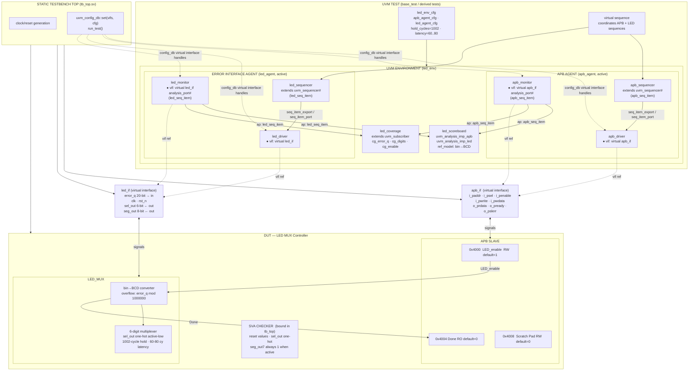
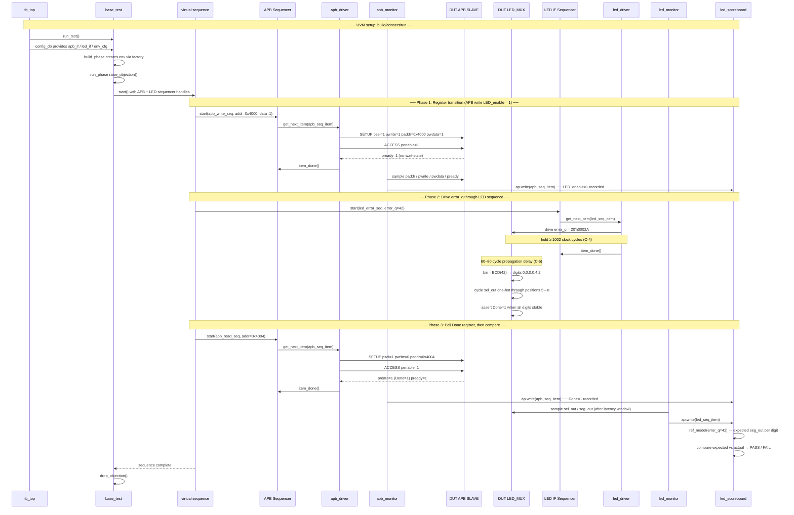
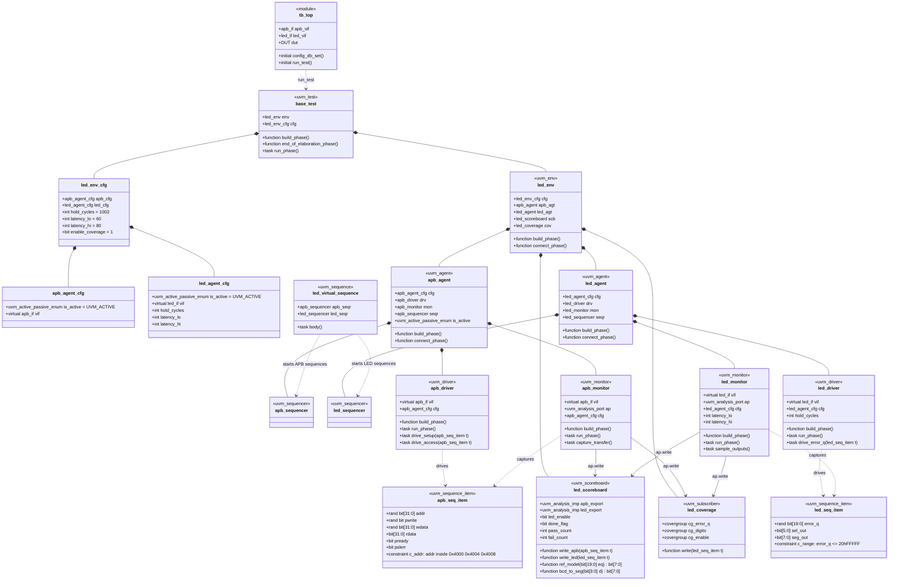

# ARCHITECTURE: LED MUX Controller — UVM 1.2 Testbench

**Source spec:** SPEC.md (PSDC_UVM_FINAL_PROJECT_DV_BATCH7.pdf, PCDA2025 Rev1.0)

This architecture follows the UVM 1.2 build/connect/run model required by the spec: RTL and interfaces live in `tb_top`, UVM classes are factory-created, virtual interfaces and timing knobs are distributed through `uvm_config_db`, and all observed transactions are broadcast through analysis ports to independent checking and coverage subscribers.

---

## 1. Component Diagram

Shows every module/class in the testbench, how they are composed, and which signals flow between them.



### Key design decisions

| Decision | Why |
|---|---|
| Two separate agents (APB + LED IF) | The DUT has two physically distinct interfaces with different protocols; one agent per interface keeps stimulus and observation cleanly separated. |
| Virtual interface references (dotted lines, ● marker) | Driver and Monitor hold a SystemVerilog `virtual` handle — no structural port connection. This is the standard UVM pattern; it decouples the testbench class hierarchy from the RTL port hierarchy. |
| Analysis ports fan out to both Scoreboard and Coverage | Both consumers need every transaction, but neither should know about the other. The `uvm_analysis_port` broadcast model keeps them fully decoupled. |
| `tb_top` sets virtual interfaces through `uvm_config_db` | UVM classes cannot connect directly to RTL ports. The static top module instantiates the interfaces, places their virtual handles in the config database, and starts UVM with `run_test()`. |
| Agents are active by default but configurable | The project needs APB and LED stimulus, so both agents start as `UVM_ACTIVE`. Keeping `is_active` in each agent config makes passive reuse possible for future subsystem verification. |
| Coverage implemented as subscriber-style component | A coverage collector consumes monitor transactions like any other analysis subscriber. This keeps covergroups independent from the scoreboard's pass/fail logic. |
| SVA bound directly to DUT | Assertions fire in zero-sim-time relative to RTL signals, catching protocol violations that a UVM monitor (which samples at clock edges) might miss by one cycle. |
| Scoreboard holds reference model internally | The bin→BCD conversion and 7-segment encoding are simple enough to replicate inline; a separate reference model process is unnecessary overhead. |

---

## 2. Sequence Diagram

Traces one complete UVM stimulus cycle: `tb_top` starts UVM and publishes virtual interfaces, the test raises a run-phase objection, a virtual sequence coordinates APB and Error IF sequences, monitors publish observed transactions, then the scoreboard compares only after Done is observed.



### Key design decisions

| Decision | Why |
|---|---|
| Test owns objections; sequences do not | The test controls simulation lifetime in `run_phase`. Sequences remain reusable transaction generators and do not decide when the phase ends. |
| Virtual sequence coordinates both agents | APB control/status traffic and LED stimulus must be ordered together. A virtual sequence centralizes cross-interface ordering without coupling the two agents. |
| APB write precedes `error_q` drive | The `LED_enable` state must be known to the scoreboard before any `seg_out` comparison — order matters because `LED_enable=0` suppresses output entirely (FR 3.4). |
| `item_done()` called before monitor samples | The driver releases the item as soon as the bus cycle completes; the monitor observes the same signals independently. This is the UVM split-transaction model — driver and monitor are never coupled. |
| Done register polled before scoreboard comparison | `seg_out` is indeterminate when `Done=0` (FR 3.5 / AC-D1). Sampling before `Done=1` would produce false failures; polling via APB is the only safe gate. |
| 1002-cycle hold enforced in driver (not test) | The hold-time constraint (C-4) is a driver-level protocol rule, not a test-level concern. Encoding it in `led_driver` makes it impossible for any sequence to violate it. |
| 60–80 cycle latency window respected by monitor | The monitor must not sample outputs within this window (C-5). The monitor tracks cycles since `error_q` changed and defers sampling until the window closes. |

---

## 3. Class Diagram

Shows the data model: transaction objects, UVM component classes, their fields, and the composition/dependency relationships.



### Key design decisions

| Decision | Why |
|---|---|
| Separate config objects for env and agents | `led_env_cfg`, `apb_agent_cfg`, and `led_agent_cfg` make virtual interfaces, active/passive mode, timing windows, and coverage enables explicit build-time settings instead of scattered constants. |
| Every UVM class is factory-registered | Components, sequences, and sequence items should use the appropriate UVM utility macro so tests can override behavior without editing the environment. |
| Two separate transaction classes (`apb_seq_item`, `led_seq_item`) | The APB and LED interfaces have fundamentally different signal sets and randomisation constraints; a shared base class would only add complexity with no reuse benefit. |
| `addr` constrained to `{0x4000, 0x4004, 0x4008}` in `apb_seq_item` | These are the only valid register addresses. Constraining at the item level means every sequence automatically stays in-range without extra guard code. |
| `hold_cycles` and `latency_lo / latency_hi` as fields, not constants | Allows tests to override via `uvm_config_db` for corner-case timing tests without subclassing the driver or monitor. |
| `led_scoreboard` contains the reference model (`ref_model`, `bcd_to_seg`) | The DUT's logic (bin→BCD + 7-segment encoding) is simple and deterministic. An embedded golden model is easier to audit against the spec's segment table (Section 4.4) than an external model. |
| `led_coverage` is a separate class (not inside scoreboard) | Coverage closure and correctness checking are orthogonal concerns. Separating them means either can be disabled, replaced, or extended independently. |
| `uvm_analysis_imp` with two ports in scoreboard | The scoreboard needs both APB context (what `LED_enable` is set to) and LED IF data (actual `seg_out`) to make a correct comparison. Two named imports handle the fan-in cleanly using the `uvm_analysis_imp_decl` macro. |

---

## 4. UVM Implementation Flow

This is the build order and responsibility split the SystemVerilog implementation should follow.

### Static top (`tb_top.sv`)

- Instantiate the DUT, `apb_if`, and `led_if`.
- Generate `clk` and drive/reset `rst_n`.
- Bind the SVA checker to the DUT or DUT interfaces.
- Publish virtual interfaces before `run_test()`:

```systemverilog
uvm_config_db#(virtual apb_if)::set(null, "uvm_test_top.env.apb_agt*", "vif", apb_vif);
uvm_config_db#(virtual led_if)::set(null, "uvm_test_top.env.led_agt*", "vif", led_vif);
run_test();
```

### Test layer

- `base_test` creates `led_env_cfg`, sets default timing/configuration, creates `led_env` through the factory, and passes config through `uvm_config_db`.
- Derived tests override only scenario intent: reset test, enable/disable test, overflow test, scratch-pad test, APB error test, and randomized regression test.
- `run_phase` raises one objection, starts a virtual sequence, waits for completion, then drops the objection.

### Environment and agents

- `led_env.build_phase` gets `led_env_cfg`, creates both agents, scoreboard, and coverage when enabled.
- Each agent always creates its monitor. It creates sequencer and driver only when `cfg.is_active == UVM_ACTIVE`.
- Each active agent connects `driver.seq_item_port` to `sequencer.seq_item_export` in `connect_phase`.
- Monitors publish completed transactions through `uvm_analysis_port`; they do not call scoreboard methods directly.

### Checking and coverage

- `led_scoreboard` keeps APB-visible state (`LED_enable`, `Done`, scratch-pad mirror) and compares LED observations only after `Done == 1`.
- `led_coverage` samples monitor transactions and crosses digit position, digit value, overflow/non-overflow, and enable state.
- SVA handles cycle-accurate protocol and signal invariants: reset values, APB two-phase behavior, `sel_out` one-hot active-low, and `seg_out[7] == 1` when active.
